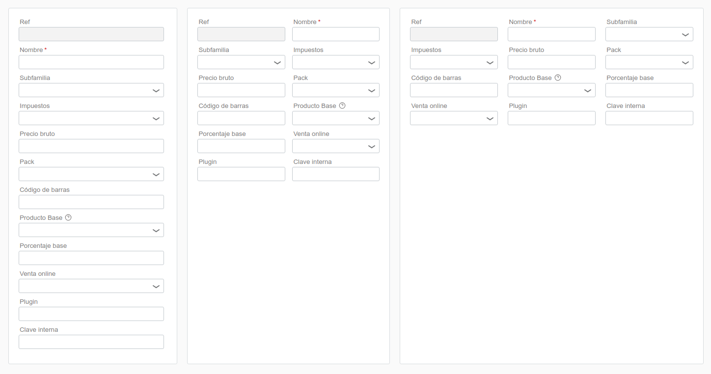

Ejemplo:


```json
{
    "type": "tile",
    "children": [
        {
            "title": "@@Detalle",
            "type": "header",
            "buttons": [
                {
                    "icon": "new",
                    "onClick": {
                        "target": "detail",
                        "command": "create"
                    }
                },
                {
                    "icon": "copy",
                    "onClick": {
                        "target": "detail",
                        "command": "copy",
                        "callback": [
                            {
                                "target": "products",
                                "command": "refresh"
                            }
                        ]
                    }
                },
                {
                    "icon": "trashcan",
                    "onClick": [
                        {
                            "target": "detail",
                            "command": "delete",
                            "callback": [
                                {
                                    "target": "products",
                                    "command": "refresh"
                                }
                            ]
                        }
                    ]
                }
            ]
        },
        {
            "id": "detail",
            "type": "amura.entityDetail",
            "entity": "amura.billing.product"
        },
        {
            "type": "row",
            "class": "formButtonsRight",
            "children": [
                {
                    "type": "button",
                    "label": "@@Guardar",
                    "class": "highlighted",
                    "onClick": [
                        {
                            "target": "detail",
                            "command": "save",
                            "callback": [
                                {
                                    "target": "products",
                                    "command": "refresh"
                                },
                                {
                                    "target": "prices",
                                    "command": "refresh"
                                }
                            ]
                        }
                    ]
                }
            ]
        }
    ]
}
```


Se pueden especificar múltiples columnas:



```json
{
    "type": "dashboard",
    "children": [
        {
            "type": "row",
            "children": [
                {
                    "type": "tile",
                    "style": {
                        "width": "25%"
                    },
                    "children": [
                        {
                            "id": "detail",
                            "type": "amura.entityDetail",
                            "entity": "amura.billing.product",
                            "columns": 1
                        }
                    ]
                },
                {
                    "type": "tile",
                    "style": {
                        "width": "30%"
                    },
                    "children": [
                        {
                            "id": "detail",
                            "type": "amura.entityDetail",
                            "entity": "amura.billing.product",
                            "columns": 2
                        }
                    ]
                },
                {
                    "type": "tile",
                    "style": {
                        "width": "45%"
                    },
                    "children": [
                        {
                            "id": "detail",
                            "type": "amura.entityDetail",
                            "entity": "amura.billing.product",
                            "columns": 3
                        }
                    ]
                }
            ]
        }
    ]
}
```


Y se ajustan automáticamente en modo responsive:

