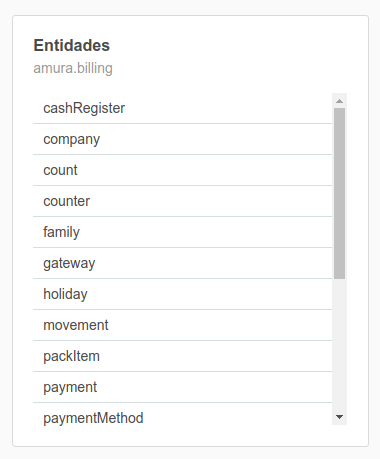

## Lista



Ejemplo con múltiples acciones al hacer click en una fila:

```json
{
    "type": "tile",
    "children": [
        {
            "title": "@@Entidades",
            "type": "header"
        },
        {
            "id": "entities",
            "type": "amura.list",
            "class": "clickable",
            "columns": [
                "name"
            ],
            "options": {
                "headerVisible": false
            },
            "onClick": [
                {
                    "target": "propertiesHeader",
                    "command": "setSubtitle",
                    "args": "${name}"
                },
                {
                    "command": "load",
                    "target": "properties",
                    "args": {
                        "url": "/amura/orm/properties.api",
                        "args": {
                            "plugin": "${plugin}",
                            "entity": "${name}"
                        }
                    }
                }
            ]
        }
    ]
}
```