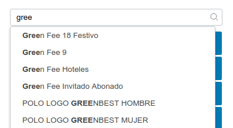
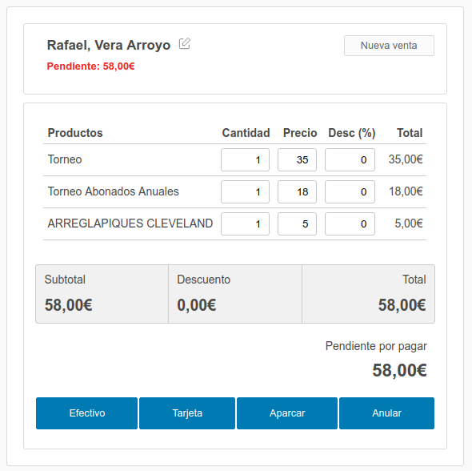

# AML 

To [create a widget](widgets.md)  in typescript

Ejemplo de AML:

```json
{
    "type": "dashboard",
    "children": [
        {
            "type": "tile",
            "children": [
                {
                    "title": "@@Clientes",
                    "type": "header"
                },
                {
                    "id": "list",
                    "type": "amura.entityGrid",
                    "entity": "amura.crm.client"
                }
            ]
        }
    ]
}
```

## Maquetación

Ejempo de un dashboard con dos columnas: una a la derecha de 300px y el resto ocupado por la de la izquierda:

```json
{
    "type": "amura.adminview",
    "children": {
        "body": {
            "type": "dashboard",
            "children": [
                {
                    "type": "row",
                    "children": [
                        {
                            "type": "column",
                            "style": {
                                "flex": 1
                            },
                            "children": []
                        },
                        {
                            "type": "column",
                            "style": {
                                "width": "300px"
                            },
                            "children": []
                        }
                    ]
                }
            ]
        }
    }
}
```

[Acciones](actions.md) 

## Widgets
v 
 - [entitygrid](entitygrid.md)
 - [list](list.md)
 - [timetable](timetable.md)
 - [search](search.md)


### Lookup



```json
{
    "type": "amura.lookup",
    "loadURL": "/amura/billing/orm/lookup.api?entity=product",
    "placeholder": "@@buscar producto",
    "icon": "search",
    "onChanged": {
        "target": "pos",
        "command": "addProduct",
        "args": "${id}"
    }
}
```


### Quick search
```json
{
    "type": "amura.quickSearch",
    "placeholder": "@@Buscar",
    "onEnter": {
        "target": "list",
        "command": "refresh",
        "args": {
            "quickSearch": {
                "value": "${@}"
            }
        }
    }
}
```


### Point Of Sale



```json
{
    "type": "amura.pos",
    "id": "pos",
    "onSaleChanged": [
        {
            "target": "parkedSales",
            "command": "refresh"
        },
        {
            "target": "lastSales",
            "command": "refresh"
        }
    ]
}
```


### Chart

Basado en [jsChart](http://www.chartjs.org/docs/latest/)

Los valores de "chart" se pasan directamente a jschart como el segundo argumento, por lo que referirse a su documentación
para opciones.


```json
 {
    "type": "amura.dbChart",
    "queryKey": "/apps/main/sql/salesByProduct.sql",
    "chart": {
        "type": "bar",
        "options": {
            "maintainAspectRatio": false,
            "legend": {
                "display": false
            },
            "scales": {
                "yAxes": [
                    {
                        "ticks": {
                            "beginAtZero": true
                        }
                    }
                ]
            }
        }
    }
}
```

